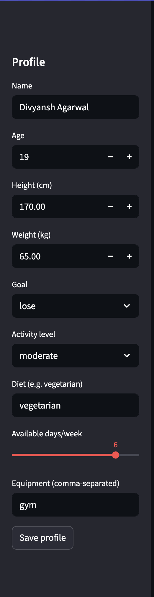
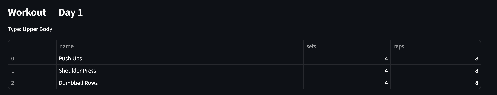
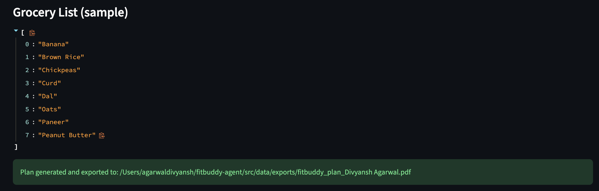

# FitBuddy — AI Gym & Meal Planner Agent

FitBuddy is an AI-powered personal fitness assistant that generates a **7-day workout plan**, **daily meal suggestions**, and a **grocery list** based on a short input profile.  
It also supports plan export to PDF and provides a clean **Streamlit UI** for easy demo and evaluation.

This project is built for the **OpenAI Capstone Multi-Agent Competition** (Agents for Good track — Health & Fitness).

---

# 🌟 Why FitBuddy?

Most beginner gym-goers and busy students struggle with:
- knowing **what exercises** to do,
- choosing **meals that match their diet**,  
- planning **affordable grocery lists**,  
- fitting workouts into their **available weekly days**.

FitBuddy solves this with:
- **personalized intake agent**
- **RAG retrieval** of grounded fitness & nutrition facts  
- **planner agent** that composes a complete weekly plan  
- **tracker agent** for small adaptive suggestions  
- **one-click PDF export**  
- **Streamlit UI demo** for judges to run easily  

---

# 🧠 Architecture Overview

FitBuddy is a **multi-agent system** built around distinct responsibilities:

### **1. IntakeAgent**
Collects user profile:
- Name  
- Diet type  
- Equipment available  
- Days per week  
Stores it in `data/last_profile.json`.

### **2. RAGAgent**
Builds a retrieval index from:
- sample exercises (`exercise_db`)
- nutrition items (`nutrition_db`)

Uses `sentence-transformers` (or TF-IDF fallback) to retrieve relevant foods/workouts.

### **3. PlannerAgent**
Produces:
- **7-day workout plan**
- **daily meal suggestions**
- **grocery list**

Saves to `data/last_plan.json`.

### **4. TrackerAgent**
Logs user progress and provides rule-based plan adjustments.

### **5. PDF Exporter**
Creates a downloadable weekly PDF.

### **6. Streamlit UI**
Interactive demo to save profile, generate plan, and export PDF.

---

# 🖼️ Screenshots

### **Profile Saved**


### **Generated Day-1 Workout**


### **Grocery List + PDF Export**


---

# 🐍 Project Structure

```
fitbuddy-agent/
│
├── src/
│   ├── agents/
│   │   ├── intake_agent.py
│   │   ├── rag_agent.py
│   │   ├── planner_agent.py
│   │   ├── tracker_agent.py
│   │
│   ├── services/
│   │   ├── exercise_db.py
│   │   ├── nutrition_db.py
│   │   ├── vectorstore.py
│   │   ├── pdf_exporter.py
│   │
│   ├── app.py        ← Streamlit UI
│   └── data/
│       ├── last_profile.json
│       ├── last_plan.json
│       └── exports/
│
├── docs/
│   ├── deployment.md
│   └── screenshots/
│
├── requirements.txt
├── architecture.md
└── README.md
```

---

# 🚀 How to Run Locally (macOS/Linux/Windows)

## **1. Clone repo**
```bash
git clone <your repo url>
cd fitbuddy-agent
```

---

## ⭐ Option A (Recommended): Conda environment
```bash
conda create -n fitbuddy python=3.10 -y
conda activate fitbuddy

pip install --upgrade pip setuptools wheel
pip install -r requirements.txt
```

---

## ⭐ Option B: Python venv (simple)
```bash
python3 -m venv .venv
source .venv/bin/activate

pip install --upgrade pip
pip install -r requirements.txt
```

---

# ▶️ Run the Streamlit UI
```bash
export PYTHONPATH="$PWD/src"
python -m streamlit run src/app.py
```

Then open:
👉 http://localhost:8501

You will see:
- Sidebar profile  
- Generate Plan button  
- Workout plan pages  
- Grocery list  
- PDF export button  

---

# 📝 One-Shot Programmatic Demo
```bash
python - <<'PY'
from src.agents.intake_agent import default_profile, save_profile
from src.agents.rag_agent import build_knowledge_and_index, retrieve
from src.agents.planner_agent import plan_from_profile
from src.services.pdf_exporter import export_plan_to_pdf

p = default_profile()
p['name']='DemoUser'
p['equipment']=['none']
p['diet']='vegetarian'
p['available_days']=4
save_profile(p)

vs = build_knowledge_and_index()
hits = retrieve(vs, "high protein vegetarian", top_k=3)
plan = plan_from_profile(p, rag_results=hits)

print("Day 1 Workout:", plan['workout_plan']['day_1'])
print("PDF exported to:", export_plan_to_pdf(plan, "test_plan.pdf"))
PY
```

---

# 📦 Requirements

```
streamlit
pandas
numpy
scikit-learn
sentence-transformers
reportlab
pytest
```

---

# ☁️ Deployment (Streamlit Cloud)

Deploy easily on **Streamlit Cloud**:

1. https://streamlit.io/cloud → Login with GitHub  
2. New App → Select repo  
3. Branch: `main`  
4. File path: `src/app.py`  
5. Deploy  

After deployment, add URL here:

**Live Demo:** _<add URL here after deploying>_

---

# 🧪 Tests

```bash
pytest -q
```

---

# 👤 Author
**Divyansh Agarwal**  
COE — Thapar Institute
